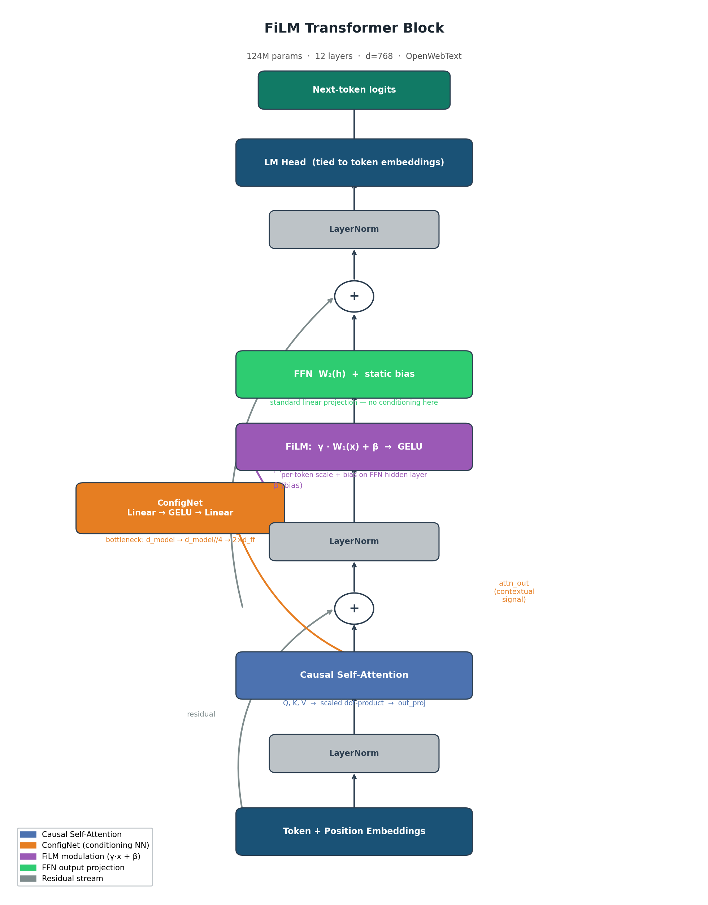
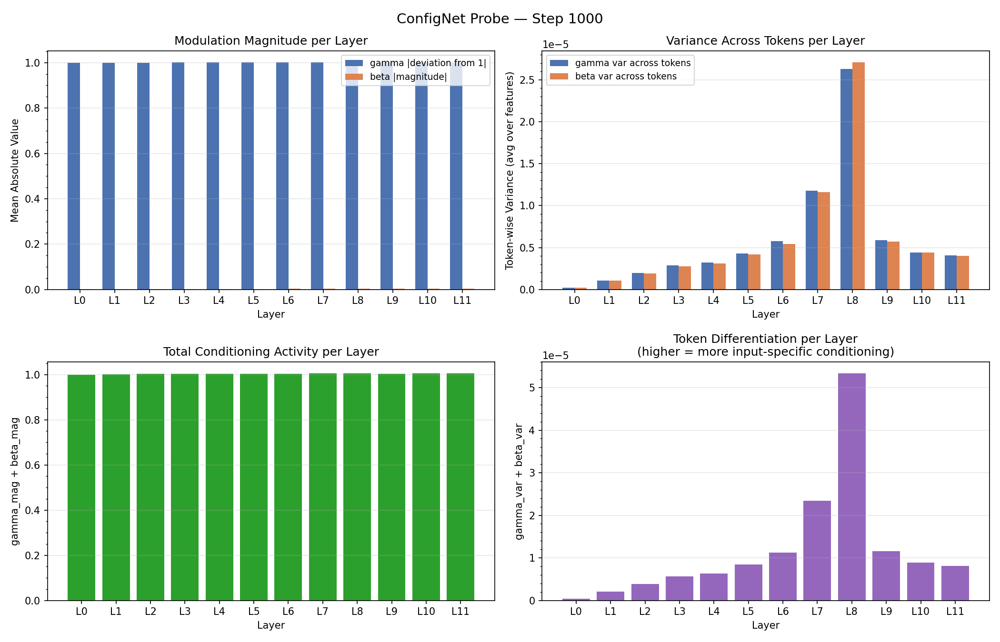
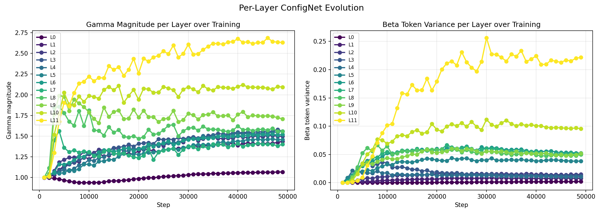
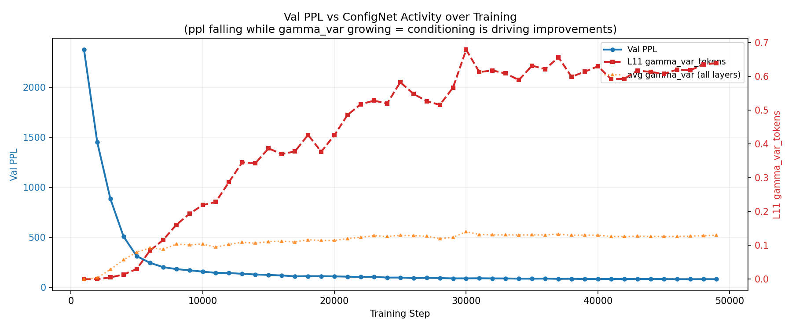
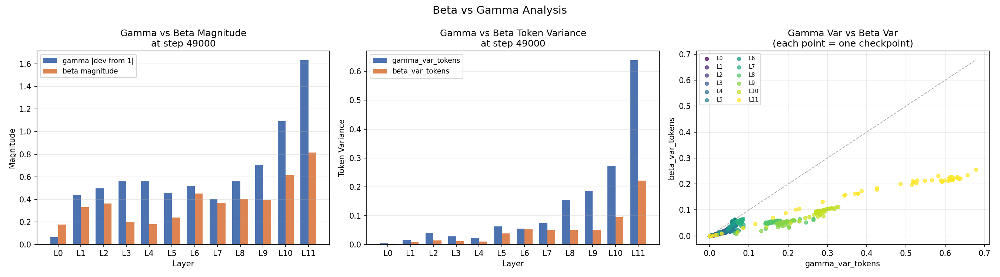
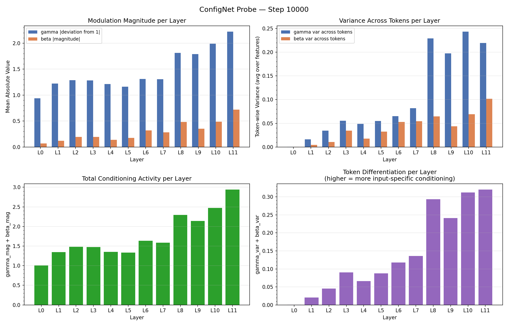
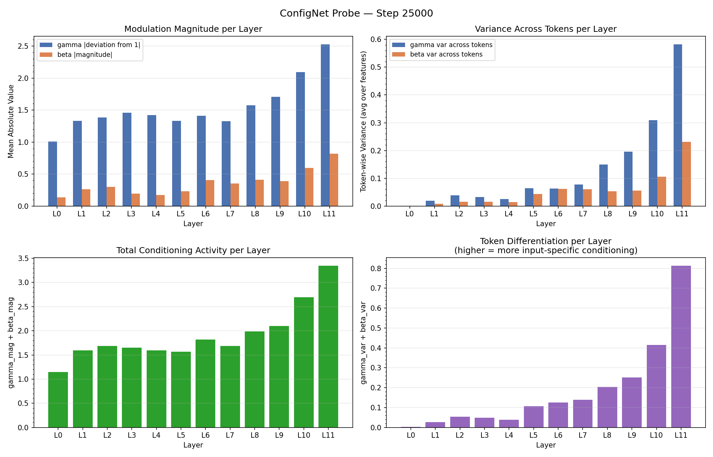

# [Dynamic Bias Transformer]
**Sukrit Koirala | [Date]**

---

## Abstract

What I suggest in this write-up is my findings from running a modification in the Transformer Architecture, which I like to call Dynamic Bias Transformer. It modifies the Transformer Architecture by adding a hypernetwork (a network for generating scaling and bias vector based on the input). The model demonstrated the ability to show input-specific conditioning without any routing overhead. To my knowledge this is a big problem with MoE architecture, so the result might suggest a possible research area to fix the major problems MoE has, such as load balancing and expert assignment. Additionally, the model discovered that conditioning is only useful in the final layers, suppressing it in early layers and amplifying it in late layers, which matches what we know about transformer layer roles but this behaviour was learnt not explicitly designed. While the DBT (Dynamic Bias Transformer) was not able to beat baseline at 50k steps and 124M parameters (80.6 vs 73.0) ppl, I think its because of architectural inefficiency rather than a fundamental limitation. After showing the results I propose a new architecture called Sparse ConfigNets, where we apply ConfigNets only on the last 3 layers (for now).


## 1. Motivation

Standard transformer FFNs apply identical weights to every token regardless of context. MoE addresses this through discrete routing but requires load balancing losses, suffers from expert collapse at small scale, and multiplies parameter count. DBT asks a simpler question: Can a transformer learn per-token adaptive computation through continuous conditioning, with no routing, no auxiliary losses, and no extra experts?


## 2. Architecture

DBT is a standard GPT-2 style transformer with one modification per block: after the attention sublayer computes its output, a small hypernetwork (ConfigNet) reads that output and generates a per-token scale and bias vector. These vectors are applied to the FFN's hidden layer before the activation function, the FFN sees a different modulated input for every token depending on what attention computed for it. Everything else is identical to a standard transformer: pre-norm, causal self-attention, weight tying, same parameter count. (see Figure 1)

The key intuition is that attention already does the hard work of figuring out what each token means in context. ConfigNet just reads that result and translates it into "how should the FFN process this specific token", a scale and shift applied before the nonlinearity that steers which FFN neurons fire and by how much.

The formula per transformer block:

```
attn_out = Attention(LayerNorm(x))
x        = x + attn_out

gamma, beta = ConfigNet(attn_out)
h           = GELU(gamma * W1(LayerNorm(x)) + beta)
x           = x + W2(h)
```

**ConfigNet:** A small bottleneck network, `Linear(d_model, d_model//4) -> GELU -> Linear(d_model//4, 2*d_ff)`, that reads the attention output and produces a scale (gamma) and bias (beta) vector of size d_ff. One ConfigNet per transformer block, applied before the FFN activation.

**Key design choices:**

Why Zero-init?
- At step 0, its just a standard Transformer, so any advantage it gains must be earned through learning, not given by initialization.

Why Parameter Matching?
- d_ff is slightly reduced in DBT to compensate for the ConfigNet parameters, keeping total parameter count identical to baseline. The comparison is controlled, neither model has more capacity than the other.

Why Attention's output as input signal?
- It is the richest per-token signal available before the FFN runs. Attention has already integrated context across all previous tokens, so `attn_out` encodes what this specific token means in this specific context.

---

## 3. Experimental Setup

| | Baseline | DBT |
|---|---|---|
| Architecture | GPT-2 style, pre-norm, causal attention, weight tying | Same + ConfigNet per block |
| Parameters | 124M | 124M |
| Training data | OpenWebText | OpenWebText |
| Validation data | WikiText-103 | WikiText-103 |
| Steps | 50k | 50k |
| Hardware | A100 SXM4 80GB | A100 SXM4 80GB |


## 4. Results

### 4.1 Perplexity Comparison

| Step | Baseline PPL | DBT PPL | Gap |
|------|-------------|----------|-----|
| 10k | 144.8 | 151.5 | +6.7 |
| 20k | 93.3 | 108.3 | +15.0 |
| 30k | 83.7 | 90.3 | +6.6 |
| 40k | 77.3 | 81.7 | +4.4 |
| 49k | 73.0 | 80.6 | +7.6 |

### 4.2 Ruling Out Learning Rate Decay

To test whether the ConfigNet's learning rate decaying too fast was causing the gap, a second DBT variant was trained at medium scale (44M params, 8k steps) with the ConfigNet parameters given a 3x higher learning rate than the rest of the model. The results were as follows:

| Step | Baseline | DBT (standard LR) | DBT (3x ConfigNet LR) |
|------|----------|-------------------|----------------------|
| 3000 | 73.7 | 73.7 | 73.9 |
| 6000 | 39.2 | 43.5 | 42.8 |
| 8000 | 33.7 | 39.4 | 39.4 |

Both DBT variants ended at identical perplexity (39.4 ppl). Learning rate decay is not the cause of the gap.

## 5. ConfigNet Probe Analysis

I was heavily dissatisfied from the results of my experiment, so I decided to dig deeper into why the architecture failed. That led me to questioning the ConfigNet itself, and if it was even producing anything meaningful or just getting skipped over by the Base Transformer Architecture. Hence my idea was to measure how much the Beta and Gamma were affecting the outputs which led to two new metrics gamma_mag and beta_mag. Then two more metrics were introduced: gamma_var_tokens and beta_var_tokens, measuring the variance of gamma and beta across tokens, capturing whether the ConfigNet produces different outputs per token or applies the same conditioning uniformly regardless of input, if not it would suggest it performs same as a standard Transformer.

| Metric | Definition |
|---|---|
| `gamma_mag` | Mean absolute deviation of gamma from 1.0. Zero means ConfigNet is not scaling anything, higher means active modulation. |
| `beta_mag` | Mean absolute magnitude of beta. Zero means no additive shift. |
| `gamma_var_tokens` | Variance of gamma across tokens. Zero means every token gets identical conditioning, higher means the ConfigNet is making token-specific decisions. |
| `beta_var_tokens` | Same for beta. |

### 5.1 Zero-Init Verification

At step 1000, all layers show gamma_mag is approx 1.000 and gamma_var_tokens is approx 0.000 (see Figure 2). Every token receives identical conditioning of gamma=1, beta=0, making DBT functionally identical to a standard transformer at the start of training. This confirms the zero-init is working correctly and that any advantage DBT develops must come from learning, not initialization.

### 5.2 Emergent Layer Specialization

Unlike a standard transformer, which applies identical FFN weights to every token with no mechanism for per-token adaptation, DBT gives every layer the ability to condition dynamically. The finding is not just that late layers matter more, that is already known from interpretability research. The finding is that when given the freedom to condition dynamically at every layer, the model self-allocated that capacity entirely to the final layers, suppressing it where it wasn't useful and amplifying it where it was. That choice only becomes visible because the architecture made it possible. This is supported by the probe data at step 49k (see Figures 2 and 3):

| Layer | gamma_mag | gamma_var_tokens |
|---|---|---|
| L0 | 1.068 | 0.004 |
| L1 | 1.439 | 0.017 |
| L5 | 1.459 | 0.064 |
| L8 | 1.561 | 0.155 |
| L9 | 1.708 | 0.185 |
| L10 | 2.094 | 0.273 |
| L11 | 2.632 | 0.638 |

L11 reaches a gamma magnitude of 2.63, meaning the FFN hidden neurons are being scaled by over 2x depending on the token, while L0 barely deviates from identity. The model effectively turned off conditioning in the first half of the network and concentrated it entirely in the last three layers.

### 5.3 Two Behavioral Groups

The per-layer stability plot reveals two distinct behavioral groups that emerged during training (see Figure 4):

| Group | Layers | Behaviour |
|---|---|---|
| Settled | L1-L9 | gamma magnitude jumped to ~1.4-1.6 by step 5k and flatlined. Found their conditioning level early and stopped updating. For the remaining 45k steps they contributed nothing new. |
| Still learning | L10-L11 | Kept growing continuously throughout all 50k steps, with L11 reaching 2.63 by the end and showing no sign of flattening. The only layers still actively learning at step 49k. |

By step 7k, L9-L11 already accounted for 35% of total conditioning activity despite representing only 25% of layers, a share that held stable for the remaining 43k steps.

This matters for one reason: a converged model would show flat variance across all layers. L11 is still growing, which means DBT has not finished learning. The gap with baseline is being measured at a point where the model that needs more training is compared against one that converges faster by design.

### 5.4 Warmup Cost

Zero-init means every ConfigNet starts as a no-op. For the first ~2k steps, DBT is functionally identical to a standard transformer, but with a slightly narrower FFN due to parameter matching. Baseline is using all its parameters productively from step 0. DBT is not. (see Figure 5)

This explains the shape of the PPL gap. The gap peaked at step 20k (+15 ppl), the point where baseline had been learning freely while DBT's ConfigNets were still warming up. From step 20k onward the gap closed consistently as conditioning became active, reaching +4.4 at step 40k. The gap then slightly reopened at step 49k (+7.6) as the cosine LR tail reduced the learning rate for both models, but DBT's ConfigNets which needed more steps to converge were penalized more.

The warmup cost is not a fundamental flaw. It is a consequence of applying ConfigNet to all 12 layers simultaneously. With 12 ConfigNets warming up in parallel, the dead zone is longer than necessary. This directly motivates Sparse ConfigNets: fewer ConfigNets means shorter warmup, and the probe data already tells you which layers those should be.

### 5.5 Beta vs Gamma

Across all layers and all checkpoints, gamma consistently dominates beta in token variance (see Figure 6). At step 49k, L11 shows gamma_var_tokens = 0.638 against beta_var_tokens = 0.22. Every layer falls below the y=x line, beta variance never exceeds gamma variance anywhere in the network.

What this means: the model learned to rely almost entirely on multiplicative conditioning for token-specific decisions. Beta applies a roughly uniform additive shift across tokens. It adjusts the baseline activation level of the FFN but does not differentiate between tokens. Gamma is where all the per-token discrimination happens.

This also has an architectural implication. The bias term in ConfigNet is largely wasted capacity. A scale-only version of DBT outputting only gamma would likely perform identically while being simpler and freeing up parameters for where they actually matter.

### 5.6 The L8 Anomaly

At step 10k, L8 had the highest token variance (0.22), nearly equal to L11 (0.21) (see Figure 7). L8 was competing with L11 for most active layer. By step 25k, L11 had pulled clearly ahead (0.58) while L8 had fallen back to 0.15, a position it held for the rest of training.

This was unexpected. L8 is not a late layer, it sits in the middle of the network. The most likely explanation is that early in training, L8 representations were the most variable and contextually rich signal available, making it a useful conditioning point before the deeper layers had fully developed their representations. As training progressed and L11 built richer semantic representations, the gradient shifted conditioning weight toward L11 and away from L8.

This suggests the hierarchy is not static, it was negotiated during training. The model did not immediately know that L11 was the right layer to condition on. It explored, found a temporary solution at L8, then refined toward L11 as representations matured. This is further evidence that the architecture is doing real learning rather than trivially collapsing to a fixed pattern.

---

## 6. Interpretation

### 6.1 Why DBT Trails Baseline

Three hypotheses were considered:

| Hypothesis | Tested | Conclusion |
|---|---|---|
| ConfigNet LR decays too fast | Yes, 3x ConfigNet LR experiment | Ruled out. Both variants ended at 39.4 ppl. |
| Fundamental architectural limitation | No direct test | Unlikely given probe shows active, growing conditioning |
| Warmup cost + wasted parameters | Indirectly via probe | Most likely explanation |

The most supported explanation is structural: zero-init means all 12 ConfigNets start as no-ops, costing roughly 2k steps where DBT is a parameter-matched but slightly narrower transformer competing against a baseline using all its capacity from step 0. The gap peaked at step 20k, the point where this warmup cost was most damaging, and closed as conditioning became active. The gap then partially reopened at the end as cosine LR decay slowed both models, but DBT's still-learning ConfigNets were penalized more. Nine of twelve ConfigNets never contributed meaningful conditioning, meaning the parameter budget spent on them was wasted throughout training.

### 6.2 What the Model Discovered

Every layer was given an identical ConfigNet with equal capacity. No routing mechanism, no explicit signal about which layers should condition more. Yet by the end of training, the model had self-organized into a clear hierarchy: early layers suppressed conditioning, late layers amplified it. This was not designed, it emerged from gradient descent alone.

This is consistent with what interpretability research tells us about transformer layers: early layers handle syntax, position, and basic token relationships; late layers encode full semantic context. The model rediscovered this structure on its own, and the probe data makes it visible. The `gamma_var_tokens` metric rising from 0.004 at L0 to 0.638 at L11 is a quantitative trace of the model deciding where contextual computation is worth doing.

### 6.3 Continuous vs Discrete Routing

MoE solves the same problem, different computation per token, through discrete routing. A gating network assigns each token to one of N expert FFNs, requiring load balancing losses to prevent collapse and failing at small scale when experts don't specialize. DBT solves it through continuous conditioning: the ConfigNet outputs a scale and bias that smoothly adjusts the FFN for each token. No routing decision is ever made, no auxiliary loss is needed, and collapse is impossible by design.

The probe data confirms this is not theoretical. `gamma_var_tokens` at L11 = 0.638 means the ConfigNet is producing meaningfully different conditioning vectors for different tokens, the same mechanism MoE achieves through routing, achieved here through continuous modulation. The advantage is that it degrades gracefully: a poorly trained ConfigNet approaches identity (gamma=1, beta=0) rather than routing collapse.

---

## 7. Proposed Experiment: Sparse ConfigNets

The probe analysis points to a clear architectural inefficiency: 9 of 12 ConfigNets never contributed meaningful conditioning. The parameters spent on them were wasted, and their warmup cost created the gap that opened in early training. The natural fix is to only place ConfigNets where the model learned to use them.

### 7.1 Hypothesis

Applying ConfigNet only to the final 3 layers (L9-L11) with a larger bottleneck, redistributing the freed parameters from L0-L8, will converge faster and close the gap with baseline more effectively than the all-layer design. The early-training PPL gap that peaked at +15.0 at step 20k will be significantly smaller, because fewer ConfigNets means shorter warmup and no wasted parameters.

### 7.2 Design

L0-L8 are standard transformer blocks, normal FFN, no ConfigNet. L9-L11 each have a ConfigNet with a larger bottleneck than the current design, absorbing the parameters freed from the removed ConfigNets. Total parameter count remains matched to baseline.

| | All-layer DBT | Sparse ConfigNets |
|---|---|---|
| ConfigNet layers | L0-L11 (all 12) | L9-L11 (last 3) |
| ConfigNet bottleneck | d_model // 4 | Larger (redistributed params) |
| Total params | 124M | 124M |
| Warmup cost | 12 ConfigNets | 3 ConfigNets |

### 7.3 What Confirms the Hypothesis

- PPL gap at step 20k is smaller than +15.0
- Sparse ConfigNets closes to within 2-3 ppl of baseline by step 50k
- Probe shows L9-L11 develop higher `gamma_var_tokens` faster than in the all-layer design

### 7.4 Why It Should Work

The probe data gives three direct reasons:

1. **Warmup cost is the main cause of the early gap.** The PPL gap peaked at step 20k, exactly when 12 ConfigNets warming up simultaneously cost the most. Reducing to 3 ConfigNets reduces the warmup cost by roughly 4x. The gap should be smaller from the start.

2. **The freed parameters go where they are actually used.** In the all-layer design, the parameters spent on L0-L8 ConfigNets never contributed to token differentiation. Redistributing them to L9-L11 gives more capacity to the layers that were still actively learning at step 49k and showed no sign of plateauing.

3. **The gradient signal becomes cleaner.** Currently gradients flow through 12 ConfigNets even though 9 are not contributing. Removing them focuses the optimization entirely on the layers where conditioning is meaningful.

**Why it might not work:**

The conditioning mechanism itself may be the limitation rather than where it is applied. If `attn_out` is not a rich enough signal for the ConfigNet to condition on, even at L9-L11, then concentrating capacity there will not help. Alternatively, the parameter-matched FFN in DBT may simply be too narrow compared to baseline, and no placement of ConfigNets recovers that. These would point to needing a different architecture altogether rather than a targeted redesign.

### 7.5 What Denies the Hypothesis

- Gap at step 20k is similar to or worse than all-layer DBT
- If denied, the problem is not parameter waste or warmup cost, it points to something more fundamental, such as the conditioning signal itself (`attn_out`) being insufficient, or the FFN modulation mechanism being the wrong place to apply adaptive computation

---

## 8. Compute Request

**Hardware requested:** NVIDIA A100 SXM4 80GB (or equivalent)

| Experiment | Params | Steps | Est. GPU Hours | Purpose |
|---|---|---|---|---|
| Sparse ConfigNets (medium) | 44M | 50k | ~4.5 hrs | Proof of concept |
| Sparse ConfigNets (large) | 124M | 50k | ~22 hrs | Direct comparison to existing DBT and baseline runs |
| Sparse ConfigNets (large) | 124M | 100k | ~44 hrs | Full convergence run |

The immediate request is for the medium 50k run (~4.5 hrs) as a proof of concept. If Sparse ConfigNets closes the gap with baseline at medium scale, it justifies running the large 50k comparison (~22 hrs). The 100k large run is only needed if the 50k run shows the model has not yet converged, the same situation observed with the all-layer design. All infrastructure is already built and tested: training loop, checkpoint saving, probe scripts, and analysis pipelines are ready to run immediately.

---

## 9. Conclusion

DBT demonstrates that a transformer can learn input-specific FFN conditioning through a continuous scale mechanism, without routing, without auxiliary losses, and without expert assignment. The probe analysis confirmed this is not theoretical: by step 49k, L11 was producing genuinely different conditioning vectors for different tokens, with a gamma_var_tokens of 0.638 that was still growing.

The more unexpected finding is that the model discovered on its own where conditioning is useful. Given identical ConfigNets at every layer, it suppressed conditioning in early layers and concentrated it in the final layers, recovering a structure consistent with what interpretability research tells us about transformer layer roles. This behaviour was not designed, it emerged from gradient descent.

DBT did not beat baseline at 50k steps and 124M parameters. The probe analysis suggests this is not a fundamental limitation but an architectural inefficiency: 9 of 12 ConfigNets were wasted, and their warmup cost created a gap that never fully closed. The proposed Sparse ConfigNets experiment tests whether fixing this inefficiency, by applying ConfigNets only where the model learned to use them, is enough to close the gap.

The question DBT was built to answer, whether continuous conditioning can replace discrete routing, remains open. But the evidence so far suggests the mechanism works. The next experiment will tell us whether the architecture does too.

---

## Figures

**Figure 1:** DBT transformer block architecture. ConfigNet reads attn_out and generates per-token gamma and beta that modulate the FFN hidden layer before activation.



---

**Figure 2:** ConfigNet probe at step 1000. All layers near identity, confirming zero-init is working.



---

**Figure 3:** ConfigNet probe at step 49000. Clear hierarchy with L11 dominant (gamma_mag=2.63, gamma_var_tokens=0.638) and L0 near passive.


---

**Figure 4:** Per-layer gamma magnitude and variance over training. Shows two behavioral groups: L1-L9 settling by step 5k, L10-L11 continuing to grow throughout.



---

**Figure 5:** Val PPL vs ConfigNet activity over training. PPL falling while gamma_var grows.



---

**Figure 6:** Beta vs gamma magnitude and variance at step 49000. Gamma dominates beta across all layers.



---

**Figure 7:** ConfigNet probe at step 10000 and step 25000. Shows L8 competing with L11 early then falling back.





---

*Hardware: NVIDIA A100 SXM4 80GB. Dataset: OpenWebText (train) / WikiText-103 (val). Architecture: GPT-2 style, pre-norm, causal attention, weight tying.*
